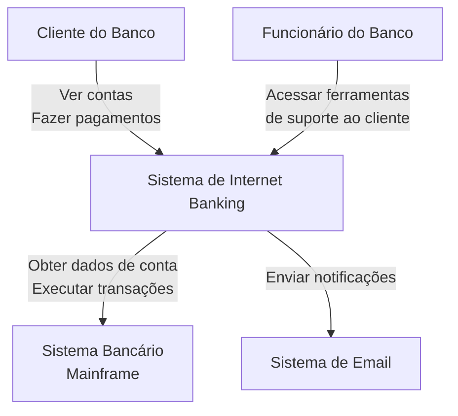
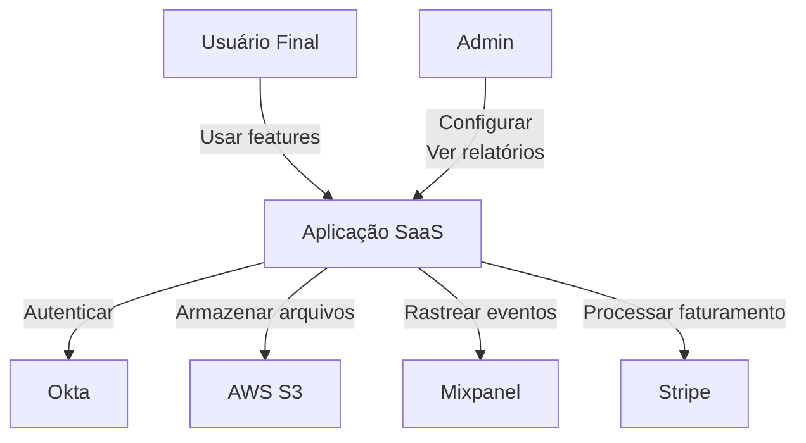

# Diagrama de Contexto do Sistema (C4 Nível 1)

**ID do Template**: TPL-C4-001
**Versão**: 2.0.0
**Categoria**: Modelo C4
**Nível**: C4 Nível 1 (Contexto do Sistema)
**Usado Por**: analyst (Fase 3: Especificação), architect (Fase 2: Design)
**Última Atualização**: 2025-11-17

---

## Propósito

O **diagrama de Contexto do Sistema** mostra o sistema em escopo e seu relacionamento com usuários e outros sistemas. Este é o **nível mais alto** de abstração no Modelo C4, fornecendo uma visão "big picture" que é compreensível tanto para stakeholders técnicos quanto não-técnicos.

**Questões-Chave Respondidas**:
- Qual é o sistema que estamos construindo?
- Quem o usa?
- Com quais outros sistemas ele interage?
- Quais são os limites do nosso sistema?

---

## Quando Usar

- ✅ **Início de novo projeto**: Definir limites do sistema
- ✅ **Documentação de arquitetura**: Fornecer visão geral de alto nível
- ✅ **Comunicação com stakeholders**: Explicar sistema para público não-técnico
- ✅ **Planejamento de integração**: Identificar dependências externas
- ✅ **Capítulo 3 do Arc42**: Contexto e Escopo do Sistema

**Localização Típica**:
- `specs/03_context/system-context.md`
- Parte do Capítulo 3 do Arc42 (Contexto e Escopo)

---

## Estrutura do Template

```markdown
# Contexto do Sistema: [Nome do Sistema]

**Sistema**: [Nome do Sistema]
**Versão**: [Versão]
**Última Atualização**: [YYYY-MM-DD]

---

## Visão Geral do Sistema

[Descrição de 1-2 sentenças sobre o que o sistema faz]

**Exemplo**:
> Plataforma de e-commerce que permite clientes navegarem produtos, fazerem pedidos e rastrearem entregas, enquanto fornece aos administradores capacidades de gestão de inventário e analytics.

---

## Diagrama de Contexto do Sistema

[Diagrama visual mostrando sistema, usuários e sistemas externos]

**Notação do Diagrama**:
- **Retângulo (Grande)**: O sistema em escopo
- **Ícone de Pessoa**: Usuários/Atores
- **Retângulo (Pequeno)**: Sistemas externos
- **Setas**: Interações/Dependências

### Exemplo Mermaid

\`\`\`mermaid
graph TB
    Customer[Cliente<br/>Pessoa]
    Admin[Administrador<br/>Pessoa]

    System[Plataforma E-commerce<br/>Sistema]

    Auth[Auth0<br/>Sistema Externo]
    Payment[Stripe<br/>Sistema Externo]
    Email[SendGrid<br/>Sistema Externo]
    Shipping[API de Entrega<br/>Sistema Externo]

    Customer -->|Navegar produtos<br/>Fazer pedidos<br/>Rastrear entregas| System
    Admin -->|Gerenciar inventário<br/>Ver analytics<br/>Configurar sistema| System

    System -->|Autenticar usuários<br/>HTTPS/OAuth 2.0| Auth
    System -->|Processar pagamentos<br/>HTTPS/REST| Payment
    System -->|Enviar notificações<br/>HTTPS/REST| Email
    System -->|Obter tarifas de frete<br/>Rastrear pacotes<br/>HTTPS/REST| Shipping
\`\`\`

### Alternativa PlantUML

\`\`\`plantuml
@startuml
!include https://raw.githubusercontent.com/plantuml-stdlib/C4-PlantUML/master/C4_Context.puml

Person(customer, "Cliente", "Usuário que compra produtos")
Person(admin, "Administrador", "Gerencia a plataforma")

System(ecommerce, "Plataforma E-commerce", "Permite compras online e gestão de pedidos")

System_Ext(auth, "Auth0", "Provedor de autenticação")
System_Ext(payment, "Stripe", "Processador de pagamentos")
System_Ext(email, "SendGrid", "Serviço de email")
System_Ext(shipping, "API de Entrega", "Provedor de entregas")

Rel(customer, ecommerce, "Navegar, pedir, rastrear", "HTTPS")
Rel(admin, ecommerce, "Gerenciar inventário, ver analytics", "HTTPS")

Rel(ecommerce, auth, "Autenticar usuários", "HTTPS/OAuth 2.0")
Rel(ecommerce, payment, "Processar pagamentos", "HTTPS/REST")
Rel(ecommerce, email, "Enviar notificações", "HTTPS/REST")
Rel(ecommerce, shipping, "Obter tarifas, rastrear pacotes", "HTTPS/REST")

@enduml
\`\`\`

---

## Atores (Usuários)

### [ACTOR-001] [Nome do Ator]

**Tipo**: Usuário Primário | Usuário Secundário | Administrador

**Descrição**: [Quem são e o que fazem]

**Objetivos**:
- [Objetivo 1]
- [Objetivo 2]
- [Objetivo 3]

**Interações com o Sistema**:
- [Interação 1]: [Descrição]
- [Interação 2]: [Descrição]

**Exemplo**:

### ACTOR-001: Cliente

**Tipo**: Usuário Primário

**Descrição**: Usuário final que compra produtos através da plataforma

**Objetivos**:
- Encontrar produtos que atendam suas necessidades
- Completar compras de forma segura e eficiente
- Rastrear status do pedido e entrega

**Interações com o Sistema**:
- **Navegar Catálogo**: Buscar e filtrar produtos
- **Gerenciar Carrinho**: Adicionar/remover itens, ver totais
- **Checkout**: Inserir informações de entrega, completar pagamento
- **Rastrear Pedidos**: Ver histórico de pedidos e status de entrega
- **Gerenciar Perfil**: Atualizar detalhes da conta, endereços salvos

---

### [ACTOR-002] [Nome do Ator]

[Repetir estrutura para cada ator]

**Exemplo**:

### ACTOR-002: Administrador

**Tipo**: Administrador

**Descrição**: Operador da plataforma que gerencia configuração do sistema e conteúdo

**Objetivos**:
- Manter catálogo de produtos preciso
- Monitorar saúde do sistema e métricas de negócio
- Responder a problemas de clientes

**Interações com o Sistema**:
- **Gestão de Produtos**: Adicionar/editar/remover produtos, gerenciar inventário
- **Gestão de Pedidos**: Ver pedidos, processar reembolsos, lidar com problemas
- **Analytics**: Ver relatórios de vendas, métricas de clientes, performance do sistema
- **Configuração**: Definir regras de preço, opções de frete, taxas

---

## Sistemas Externos

### [SYSTEM-001] [Nome do Sistema]

**Tipo**: Autenticação | Pagamento | Notificação | Analytics | etc.

**Propósito**: [Qual serviço ele fornece]

**Integração**:
- **Protocolo**: [HTTP, gRPC, WebSocket, etc.]
- **Formato**: [JSON, XML, Protobuf, etc.]
- **Autenticação**: [API key, OAuth, Certificado, etc.]

**Interações**:
- **Do Nosso Sistema**: [O que enviamos]
- **Para Nosso Sistema**: [O que recebemos]

**Exemplo**:

### SYSTEM-001: Auth0

**Tipo**: Provedor de Autenticação (Externo)

**Propósito**: Fornece serviços de autenticação e autorização de usuário

**Integração**:
- **Protocolo**: HTTPS
- **Formato**: JSON
- **Autenticação**: OAuth 2.0 / OpenID Connect

**Interações**:
- **Do Nosso Sistema**: Requisições de login, validação de token, requisições de info do usuário
- **Para Nosso Sistema**: Tokens JWT, claims de usuário, webhooks para eventos de usuário

**Por que Externo**:
- Expertise especializada em segurança
- Conformidade com padrões (OAuth 2.0, OIDC)
- Reduz carga de segurança interna

---

### [SYSTEM-002] [Nome do Sistema]

[Repetir para cada sistema externo]

**Exemplo**:

### SYSTEM-002: Stripe

**Tipo**: Processador de Pagamentos (Externo)

**Propósito**: Lida com processamento de cartão de crédito e fluxos de pagamento

**Integração**:
- **Protocolo**: HTTPS (REST API)
- **Formato**: JSON
- **Autenticação**: API keys (secreta + publicável)

**Interações**:
- **Do Nosso Sistema**: Criar payment intents, processar pagamentos, reembolsos
- **Para Nosso Sistema**: Webhooks para eventos de pagamento (sucesso, falha, estorno)

**Por que Externo**:
- Conformidade PCI DSS tratada pelo Stripe
- Processamento de pagamento padrão da indústria
- Reduz risco de fraude e responsabilidade

---

## Limites do Sistema

### No Escopo (Nosso Sistema)

O que o sistema **é responsável por**:

- [Responsabilidade 1]
- [Responsabilidade 2]
- [Responsabilidade 3]

**Exemplo**:
- Gestão de catálogo de produtos
- Carrinho de compras e fluxo de checkout
- Processamento e rastreamento de pedidos
- Gestão de conta de usuário
- Lógica de negócio e workflows

### Fora do Escopo (Externo)

O que o sistema **delega para outros**:

- [Responsabilidade delegada 1] → [Sistema Externo]
- [Responsabilidade delegada 2] → [Sistema Externo]
- [Responsabilidade delegada 3] → [Sistema Externo]

**Exemplo**:
- Autenticação de usuário → Auth0
- Processamento de pagamento → Stripe
- Entrega de email → SendGrid
- Logística de entrega → API de Entrega
- Infraestrutura cloud → AWS

---

## Padrões de Comunicação

### Síncrona (Requisição/Resposta)

| De | Para | Protocolo | Exemplo |
|----|------|-----------|---------|
| Cliente | Sistema | HTTPS/REST | Navegar produtos |
| Sistema | Auth0 | HTTPS/OAuth | Verificar token |
| Sistema | Stripe | HTTPS/REST | Criar pagamento |

### Assíncrona (Eventos/Webhooks)

| De | Para | Protocolo | Exemplo |
|----|------|-----------|---------|
| Stripe | Sistema | HTTPS/Webhook | Pagamento confirmado |
| Sistema | SendGrid | HTTPS/REST | Enviar email (fire-and-forget) |
| API Entrega | Sistema | HTTPS/Webhook | Atualização de status de entrega |

---

## Aspectos Não-Funcionais

### Segurança

- **Autenticação**: Como usuários se autenticam (via Auth0)
- **Autorização**: Como permissões são verificadas
- **Proteção de Dados**: Criptografia em repouso/trânsito
- **Conformidade**: PCI DSS, GDPR, etc.

**Exemplo**:
- Toda comunicação externa via HTTPS (TLS 1.3)
- Senhas de usuário nunca armazenadas (delegado ao Auth0)
- Dados de pagamento nunca tocam nossos servidores (Stripe.js)
- Tratamento de dados compatível com GDPR (usuários EU)

### Disponibilidade

- **Meta de Uptime**: [X]%
- **Dependências**: [Listar sistemas externos críticos]
- **Modo Degradado**: [O que acontece se sistema externo cair]

**Exemplo**:
- Meta: 99.9% uptime (8.76 horas downtime/ano)
- Dependências críticas: Auth0 (autenticação), Stripe (pagamentos)
- Modo degradado: Se Stripe cair, enfileirar pagamentos para retry

### Performance

- **Latência**: Tempos de resposta esperados
- **Throughput**: Requisições por segundo
- **Escalabilidade**: Expectativas de crescimento

**Exemplo**:
- Tempo de resposta da API: p95 < 200ms, p99 < 500ms
- Throughput: 10.000 requisições/segundo (pico)
- Escalabilidade: 100K → 1M usuários em 2 anos

---

## Contexto de Deployment

### Hospedagem

- **Provedor Cloud**: [AWS, Azure, GCP, etc.]
- **Regiões**: [Localizações geográficas]
- **Ambiente**: [Desenvolvimento, Staging, Produção]

**Exemplo**:
- **Provedor Cloud**: AWS
- **Regiões**: us-east-1 (primário), us-west-2 (DR)
- **Ambientes**: Dev, Staging, Prod (VPCs separados)

### Rede

- **Endpoints Públicos**: [APIs acessíveis da internet]
- **Endpoints Privados**: [Serviços internos]
- **CDN**: [Rede de entrega de conteúdo se aplicável]

**Exemplo**:
- **Público**: api.example.com (REST API), www.example.com (web)
- **Privado**: API admin interna, endpoints de banco de dados
- **CDN**: CloudFront para assets estáticos (imagens, CSS, JS)

---

## Templates Relacionados

### Pré-requisitos
- Nenhum (C1 é o ponto de partida para documentação de arquitetura)

### Segue Este Template
- **container.md** (TPL-C4-002) - Zoom no sistema para mostrar containers (C4 Nível 2)
- **component.md** (TPL-C4-003) - Zoom nos containers para mostrar componentes (C4 Nível 3)

### Parte De
- **arc42/03_context.md** (TPL-ARC42-03) - Capítulo 3 do Arc42: Contexto e Escopo

### Veja Também
- **arc42/01_introduction.md** (TPL-ARC42-01) - Objetivos e requisitos do sistema
- **arc42/02_constraints.md** (TPL-ARC42-02) - Restrições técnicas e organizacionais
- **adr/decision.md** (TPL-ADR-001) - Documentar por que certos sistemas externos foram escolhidos

---

## Integração com Workflow

**Fase**: 2 (Arquitetura) ou 3 (Especificação)

**Skill Principal**:
- **analyst** - Cria como parte do spec.md (Fase 3)
- **architect** - Cria como parte do design.md para complexidade HIGH (Fase 2)

**Localização de Output**:
- `changes/[change-id]/design.md` (se Fase 2)
- `specs/03_context/system-context.md` (se Fase 3)

**Pré-requisitos**:
- proposal.md aprovado
- Requisitos básicos compreendidos (Capítulo 1 do Arc42)

**Próximos Passos**:
- Criar Diagrama de Container (C4 Nível 2)
- Definir building blocks (Capítulo 5 do Arc42)

---

## Checklist de Validação

Use este checklist para garantir que seu diagrama de Contexto do Sistema está completo:

- [ ] **Sistema claramente identificado**: Nome e propósito declarados
- [ ] **Todos os atores documentados**: Cada tipo de usuário representado
- [ ] **Todos os sistemas externos identificados**: Cada dependência listada
- [ ] **Relacionamentos rotulados**: Cada seta tem rótulo claro (protocolo, propósito)
- [ ] **Limites claros**: No escopo vs fora do escopo explicitamente declarados
- [ ] **Padrões de comunicação definidos**: Síncrono vs assíncrono claramente marcado
- [ ] **Considerações de segurança**: Autenticação, autorização mencionadas
- [ ] **Diagrama compreensível**: Stakeholder não-técnico pode entender
- [ ] **Consistente com Arc42**: Alinha com Capítulo 3 (Contexto)
- [ ] **Sem detalhes de implementação**: Permanece em alto nível (sem código, sem classes)

---

## Erros Comuns

### ❌ Erro 1: Muito Detalhe
**Problema**: Incluir componentes internos, bancos de dados, detalhes de implementação

**Exemplo**:
```
❌ RUIM: Mostrando "Serviço de Usuário", "Serviço de Produto", "Banco de Dados"
✅ BOM: Apenas mostrando "Plataforma E-commerce" como sistema único
```

**Correção**: Guardar detalhes para Diagrama de Container (C4 Nível 2)

### ❌ Erro 2: Faltando Sistemas Externos
**Problema**: Mostrando sistema isolado sem dependências

**Exemplo**:
```
❌ RUIM: Apenas mostrando usuários e seu sistema
✅ BOM: Mostrando todos os sistemas externos (auth, payment, email, etc.)
```

**Correção**: Listar cada dependência externa, não importa quão pequena

### ❌ Erro 3: Relacionamentos Sem Rótulo
**Problema**: Setas sem rótulos claros

**Exemplo**:
```
❌ RUIM: Usuário → Sistema (sem rótulo)
✅ BOM: Usuário → Sistema "Navegar produtos, fazer pedidos (HTTPS)"
```

**Correção**: Cada seta deve mostrar **o quê** e **como** (protocolo)

### ❌ Erro 4: Incluindo Sistemas Internos
**Problema**: Mostrando microsserviços como caixas separadas no nível de Contexto

**Exemplo**:
```
❌ RUIM: "Serviço Auth", "Serviço Pagamento", "Serviço Notificação"
✅ BOM: Única "Plataforma E-commerce" contendo todos os serviços
```

**Correção**: Serviços internos pertencem ao Diagrama de Container (Nível 2)

### ❌ Erro 5: Detalhes de Tecnologia
**Problema**: Mencionar tecnologias específicas muito cedo

**Exemplo**:
```
❌ RUIM: "Banco de Dados PostgreSQL", "Cache Redis", "Cluster Kubernetes"
✅ BOM: "Plataforma E-commerce" (stack tech definida em outro lugar)
```

**Correção**: Escolhas de tecnologia documentadas no Capítulo 4 do Arc42 (Estratégia de Solução)

---

## Exemplos de Sistemas Reais

### Exemplo 1: Sistema Bancário



### Exemplo 2: Aplicação SaaS



---

## Dicas para Sucesso

### 1. Comece Simples
Comece com apenas usuários e sistema. Adicione sistemas externos incrementalmente.

### 2. Valide com Stakeholders
Mostre diagrama para stakeholders não-técnicos. Se não entenderem, simplifique.

### 3. Atualize Regularmente
Mantenha diagrama atual conforme integrações mudam. Revise trimestralmente.

### 4. Use Notação Consistente
Siga convenções do Modelo C4. Não invente novas formas/símbolos.

### 5. Foque no "O Quê", Não no "Como"
Descreva **o que** cada sistema faz, não **como** é implementado.

---

## Leitura Adicional

- **Modelo C4**: https://c4model.com/
- **Arc42**: https://arc42.org/ (Capítulo 3: Contexto e Escopo)
- **Livro de Simon Brown**: "Software Architecture for Developers"
- **Exemplos**: https://c4model.com/#examples

---

**Histórico de Versões**:
- v2.0.0 (2025-11-17): Criado como parte da padronização de templates
- v2.0.0 (2025-11-17): Versão inicial alinhada com workflow v2.0.0
