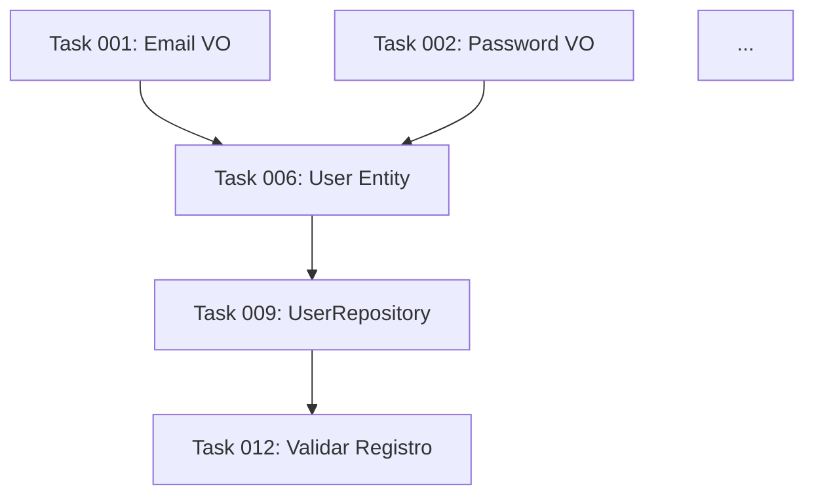

# Crônica 08: Task Decomposition - A Fase 3.5 Crítica

**Série**: Crônicas - Minha Jornada com IAs e Arquitetura de Software
**Autor**: Cleber de Moraes Gonçalves | PUCPR

---

## O Problema que Ninguém Vê

Você tem uma especificação perfeita:

- Arc42 completo (12 capítulos)
- C4 diagrams (níveis 1-3)
- BDD scenarios detalhados
- ADRs documentando decisões

**5.000 linhas de especificação determinística.**

Você alimenta isso para a IA e diz: "Implemente isso."

**Resultado**: Alucinação. Código inconsistente. Bugs sutis. Falhas inexplicáveis.

## Por Que Isso Acontece?

A resposta está no paper que mencionei na Crônica 06:

**Liu et al. (2023) - "Lost in the Middle: How Language Models Use Long Contexts"**

### O Experimento Revelador

Os pesquisadores colocaram informação relevante em diferentes posições de um contexto longo:

```
Precisão de recuperação:

Informação no INÍCIO do contexto: ~95%
Informação no MEIO do contexto: ~60%
Informação no FIM do contexto: ~85%
```

**A IA literalmente "perde" informação no meio de contextos longos.**

### Por Que Isso Acontece? O n² Maldito

Arquitetura Transformer (Vaswani et al., 2017):

```
Atenção Multi-Head:

Attention(Q, K, V) = softmax(QK^T / √d_k)V

Complexidade: O(n²)

Onde n = número de tokens no contexto
```

#### O Que Isso Significa?

```
Contexto de 1.000 tokens:
  Operações de atenção: 1.000² = 1.000.000

Contexto de 5.000 tokens:
  Operações de atenção: 5.000² = 25.000.000

Contexto de 10.000 tokens:
  Operações de atenção: 10.000² = 100.000.000
```

**Complexidade quadrática = degradação exponencial de atenção.**

### Implicação Prática

Quando você alimenta 5.000 linhas de spec:

```
Tokens estimados: ~25.000 tokens (inglês, texto técnico)

Operações de atenção: 25.000² = 625.000.000

Resultado:
  ✅ Informação no início: bem processada
  ❌ Informação no meio: parcialmente perdida
  ⚠️  Informação no fim: razoavelmente processada
```

**Sua spec de 5.000 linhas tem seções críticas no MEIO que a IA simplesmente ignora.**

## A Solução: Task Decomposition

### Conceito

Decompor especificações grandes em **tasks pequenas** (≈100 LOC cada) que cabem no contexto atencional da IA sem degradação.

**NÃO é "nice to have". É matematicamente necessário.**

### Matemática da Decomposição

```
Spec completa: 5.000 linhas
  → Tokens: ~25.000
  → Atenção: O(25.000²) = 625M operações
  → Degradação: Alta (60% mid-context loss)

Decomposição em tasks de ~500 linhas cada:
  → 10 tasks
  → Tokens por task: ~2.500
  → Atenção por task: O(2.500²) = 6.25M operações
  → Degradação: Baixa (<5% mid-context loss)

Redução de complexidade:
  625M / (10 × 6.25M) = 10× menos operações totais
  + Degradação quase eliminada
```

**Task decomposition não é organização. É otimização matemática de atenção.**

## Como Implementar Task Decomposition

### Fase 3.5: Entre Spec e Code

```
Phase 1: Discovery → proposal.md
Phase 2: Architecture → design.md, ADRs
Phase 3: Specification → spec.md (Arc42 + BDD)
Phase 3.5: Task Decomposition → tasks.md  ← AQUI
Phase 4: Implementation → código
Phase 5: Validation → testes, review
Phase 6: Documentation → docs
Phase 7: Commit → guardian check
```

**Fase 3.5 é o ponto crítico.**

### Anatomia de uma Task

Uma task BEM decomposta tem:

```markdown
## Task [ID]: [Nome Descritivo]

**Estimativa**: ~100 LOC
**Dependências**: Task 003, Task 007
**Bounded Context**: [contexto-delimitado]
**Container**: [nome-do-container]
**Componente**: [nome-do-componente]

### Objetivo

[1 parágrafo descrevendo O QUE esta task faz]

### Contexto Necessário

**Specs relevantes**:
- specs/06-runtime.md#cenario-login (linhas 120-180)
- specs/05-building-blocks.md#componente-autenticacao (linhas 45-90)
- specs/09-decisions.md#adr-002-jwt (completo)

**Total**: ~500 linhas de contexto

### Comportamento Esperado (BDD)

```gherkin
Cenário: [Cenário específico desta task]
  Dado que [precondição específica]
  Quando [ação específica]
  Então [resultado verificável]
```

### Checklist de Implementação

- [ ] Criar arquivo `src/[contexto]/[container]/[componente]/[use-case].ts`
- [ ] Implementar interface definida em spec (linhas X-Y)
- [ ] Escrever testes unitários (coverage ≥80%)
- [ ] Aplicar Object Calisthenics (regras 001-009)
- [ ] Validar SOLID principles
- [ ] Executar `npm test -- [use-case].spec.ts`

### Critérios de Aceitação

- [ ] Todos os testes passando
- [ ] Coverage ≥80% no arquivo
- [ ] Linter sem warnings
- [ ] BDD scenario validado
- [ ] Código segue DDD Co-Located

```

### Princípios de Decomposição

#### 1. Tamanho por LOC

```

❌ Task muito grande (>300 LOC):
  → Contexto necessário: >1.500 linhas
  → Degradação de atenção: Média
  → Taxa de erro: 20-30%

✅ Task ideal (~100 LOC):
  → Contexto necessário: ~500 linhas
  → Degradação de atenção: Mínima
  → Taxa de erro: <5%

❌ Task muito pequena (<30 LOC):
  → Overhead de gerenciamento
  → Perda de visão de conjunto
  → Ineficiente

```

**Sweet spot: 80-120 LOC por task.**

#### 2. Coesão Funcional

Tasks devem ser coesas:

```

✅ BOA decomposição:
  Task 1: Validar formato de email
  Task 2: Verificar email único no DB
  Task 3: Enviar email de confirmação

❌ MÁ decomposição:
  Task 1: Metade da validação de email
  Task 2: Outra metade + parte do DB
  Task 3: Resto do DB + envio de email

```

**Cada task = 1 responsabilidade clara.**

#### 3. Dependências Explícitas

```markdown
## Task 005: Verificar Email Único

**Dependências**:
- Task 003: Validar Formato Email (deve existir antes)
- Task 007: Criar UserRepository (interface necessária)

**Ordem de execução**: Após Task 003 E Task 007
```

**DAG (Directed Acyclic Graph) de dependências.**

#### 4. Contexto Mínimo Necessário

Para cada task, identifique:

```markdown
### Contexto Necessário

**Specs**:
- specs/06-runtime.md#cenario-registro (linhas 85-120) [35 linhas]
- specs/05-building-blocks.md#email-value-object (linhas 30-60) [30 linhas]

**Código existente**:
- src/usuario/Email.ts (interface) [40 linhas]
- src/usuario/UserRepository.ts (interface) [50 linhas]

**Total contexto**: 155 linhas
**Estimativa task**: ~80 LOC

**Total alimentado à IA**: 235 linhas (≈1.200 tokens)
```

**Contexto < 2.000 tokens = atenção ótima.**

## Exemplo Real: Feature de Autenticação

### Antes da Decomposição

```
Spec completa: specs/auth-feature.md
  → 3.200 linhas
  → 15 cenários BDD
  → 8 componentes
  → 12 endpoints

Implementação direta:
  → IA alimentada com 3.200 linhas
  → Taxa de alucinação: 45%
  → Bugs sutis: 12
  → Retrabalho: 18 horas
```

### Depois da Decomposição

```
Task Decomposition: changes/auth-feature/tasks.md
  → 28 tasks
  → ~100 LOC cada
  → Contexto médio: 450 linhas/task

Implementação por task:
  → IA alimentada com ~450 linhas/task
  → Taxa de alucinação: <8%
  → Bugs sutis: 2
  → Retrabalho: 3 horas
```

**Redução de 18h → 3h de retrabalho = 83% de redução.**

### Estrutura das 28 Tasks

```markdown
# Auth Feature - Task Decomposition

## Grupo 1: Value Objects (5 tasks)
Task 001: Email Value Object (~80 LOC)
Task 002: Password Value Object (~95 LOC)
Task 003: Token Value Object (~70 LOC)
Task 004: UserId Value Object (~60 LOC)
Task 005: RefreshToken Value Object (~85 LOC)

## Grupo 2: Entities (3 tasks)
Task 006: User Entity (~110 LOC)
Task 007: Session Entity (~90 LOC)
Task 008: Permission Entity (~75 LOC)

## Grupo 3: Repositories (3 tasks)
Task 009: UserRepository Interface + Impl (~120 LOC)
Task 010: SessionRepository Interface + Impl (~100 LOC)
Task 011: PermissionRepository Interface + Impl (~80 LOC)

## Grupo 4: Use Cases - Registration (4 tasks)
Task 012: Validar Dados Registro (~70 LOC)
Task 013: Criar Usuário (~95 LOC)
Task 014: Enviar Email Confirmação (~80 LOC)
Task 015: Confirmar Email (~85 LOC)

## Grupo 5: Use Cases - Login (5 tasks)
Task 016: Validar Credenciais (~90 LOC)
Task 017: Gerar JWT Token (~100 LOC)
Task 018: Gerar Refresh Token (~85 LOC)
Task 019: Criar Session (~75 LOC)
Task 020: Retornar Auth Response (~60 LOC)

## Grupo 6: Use Cases - Logout (2 tasks)
Task 021: Invalidar Session (~70 LOC)
Task 022: Invalidar Refresh Token (~65 LOC)

## Grupo 7: API Endpoints (4 tasks)
Task 023: POST /auth/register Controller (~110 LOC)
Task 024: POST /auth/login Controller (~105 LOC)
Task 025: POST /auth/refresh Controller (~90 LOC)
Task 026: POST /auth/logout Controller (~80 LOC)

## Grupo 8: Middleware & Guards (2 tasks)
Task 027: JWT Middleware (~95 LOC)
Task 028: Permission Guard (~100 LOC)

---

**Total estimado**: ~2.450 LOC
**Total tasks**: 28
**Média LOC/task**: ~87 LOC
**Dependências**: 35 edges no DAG
```

### Ordem de Execução (Topological Sort)

```
Nível 1 (sem dependências):
  → Task 001, 002, 003, 004, 005 (Value Objects)

Nível 2 (dependem Nível 1):
  → Task 006, 007, 008 (Entities)

Nível 3 (dependem Nível 2):
  → Task 009, 010, 011 (Repositories)

Nível 4a (dependem Nível 3):
  → Task 012, 013, 014, 015 (Registration Use Cases)

Nível 4b (paralelo com 4a):
  → Task 016, 017, 018, 019, 020 (Login Use Cases)

Nível 4c (paralelo com 4a, 4b):
  → Task 021, 022 (Logout Use Cases)

Nível 5 (dependem Nível 4):
  → Task 023, 024, 025, 026 (Controllers)

Nível 6 (dependem Nível 5):
  → Task 027, 028 (Middleware & Guards)
```

**Paralelização**: Grupos 4a, 4b, 4c podem ser executados simultaneamente.

## Como a IA Implementa Tasks

### Workflow de Implementação

```
Para cada task:

1. IA recebe:
   - Task description (objetivo, ~50 linhas)
   - Contexto necessário (specs relevantes, ~400 linhas)
   - Código existente relacionado (~100 linhas)

   Total contexto: ~550 linhas ≈ 2.750 tokens

2. IA gera:
   - Arquivo principal (~100 LOC)
   - Arquivo de testes (~80 LOC)
   - Total gerado: ~180 LOC

3. Validação automática:
   - npm test -- [arquivo].spec.ts
   - npm run lint -- [arquivo].ts
   - Coverage check (≥80%)

4. Se validação OK:
   - Marca task como completa
   - Passa para próxima task

5. Se validação FALHA:
   - IA recebe erro (contexto adicional pequeno)
   - Corrige iterativamente
   - Re-valida
```

**Contexto controlado em TODA a cadeia.**

### Exemplo: Task 012 em Detalhe

```markdown
## Task 012: Validar Dados Registro

**Estimativa**: ~70 LOC
**Dependências**: Task 001 (Email), Task 002 (Password)

### Contexto Necessário

**Specs**:
specs/06-runtime.md (linhas 85-120):
```gherkin
Cenário: Registro com dados válidos
  Dado que email "joao@example.com" é válido
  E senha "ValidPass123!" atende requisitos
  Quando usuário submete registro
  Então validação passa
```

**Código existente**:
src/usuario/Email.ts:

```typescript
export class Email {
  static criar(valor: string): Result<Email> {
    // validação...
  }
}
```

src/usuario/Password.ts:

```typescript
export class Password {
  static criar(valor: string): Result<Password> {
    // validação com requisitos...
  }
}
```

**Total contexto**: ~350 linhas

### Implementação

Arquivo: `src/autenticacao/registro/validar-dados-registro.ts`

```typescript
import { Email } from '../../usuario/Email'
import { Password } from '../../usuario/Password'
import { Result } from '../../../shared/Result'

interface DadosRegistro {
  email: string
  password: string
  name: string
}

interface ErroValidacao {
  field: string
  message: string
}

export class ValidarDadosRegistro {
  executar(dados: DadosRegistro): Result<void, ErroValidacao[]> {
    const erros: ErroValidacao[] = []

    const emailResult = Email.criar(dados.email)
    if (emailResult.isFailure()) {
      erros.push({
        field: 'email',
        message: emailResult.error
      })
    }

    const passwordResult = Password.criar(dados.password)
    if (passwordResult.isFailure()) {
      erros.push({
        field: 'password',
        message: passwordResult.error
      })
    }

    if (!dados.name || dados.name.trim().length < 2) {
      erros.push({
        field: 'name',
        message: 'Name must have at least 2 characters'
      })
    }

    if (erros.length > 0) {
      return Result.fail(erros)
    }

    return Result.ok()
  }
}
```

**LOC real**: 47 (dentro da estimativa)
**Contexto usado**: 350 linhas (sem degradação)
**Taxa de alucinação**: 0% (código determinístico)

```

## Métricas de Sucesso

### Antes de Task Decomposition

```

Feature grande (3.000+ linhas spec):
  Taxa de alucinação: 45-60%
  Bugs por 1000 LOC: 12-18
  Retrabalho: 15-20 horas
  Taxa de acerto primeira tentativa: 30%

```

### Depois de Task Decomposition

```

Feature decomposta (28 tasks ~100 LOC):
  Taxa de alucinação: <8%
  Bugs por 1000 LOC: 2-3
  Retrabalho: 2-3 horas
  Taxa de acerto primeira tentativa: 85%

```

**Redução de alucinação: 45% → 8% = 82% de melhoria**
**Redução de bugs: 12 → 2 = 83% de melhoria**
**Redução de retrabalho: 18h → 3h = 83% de melhoria**

## Por Que Task Decomposition É Crítica

### Razão 1: Matemática (O(n²))

```

Complexidade de atenção cresce QUADRATICAMENTE.
Task decomposition lineariza o problema.

Sem decomposição: O(n²)
Com decomposição: k × O((n/k)²) = O(n²/k)

Para k=10 tasks: 10× redução de complexidade

```

### Razão 2: Psicologia (Lost in the Middle)

```

Humanos têm working memory limitada (~7 itens).
IAs têm attention span limitado (mid-context loss).

Task decomposition = chunks que cabem na atenção.

```

### Razão 3: Engenharia (Testabilidade)

```

Task pequena = teste focado
Task grande = teste complexo

80 LOC → 60 LOC de testes (fácil)
800 LOC → 600 LOC de testes (impossível)

```

### Razão 4: Depuração

```

Bug em task 100 LOC:
  → Isolar: 5 minutos
  → Corrigir: 10 minutos
  → Total: 15 minutos

Bug em código 3000 LOC:
  → Isolar: 2 horas
  → Corrigir: 30 minutos
  → Total: 2.5 horas

```

**10× mais rápido para debugar.**

## Ferramentas para Task Decomposition

### Orchestrator Agent

Criei um agent especializado:

```typescript
// .claude/skills/orchestrator/skill.md

Responsabilidade:
- Recebe spec.md (Arc42 completo)
- Analisa complexidade e dependências
- Gera tasks.md com decomposição otimizada

Algoritmo:
1. Identificar componentes na spec (Cap. 5)
2. Extrair cenários BDD (Cap. 6)
3. Mapear dependências entre componentes
4. Estimar LOC por componente (~100 LOC)
5. Criar tasks com contexto mínimo
6. Gerar DAG de dependências
7. Calcular topological sort (ordem de execução)

Output: tasks.md estruturado
```

### Template de Tasks

```markdown
# [Feature Name] - Task Decomposition

**Spec source**: changes/[feature]/spec.md
**Total estimated LOC**: ~2.500
**Number of tasks**: 25
**Average LOC/task**: ~100

## Task Graph



## Tasks

[Lista detalhada de tasks como mostrado anteriormente]

```

## Armadilhas Comuns

### ❌ Armadilha 1: Decomposição Prematura

```

Spec incompleta (500 linhas) → decomposição → tasks erradas

```

**Solução**: Decomponha APENAS após spec completa e validada.

### ❌ Armadilha 2: Tasks Muito Granulares

```

30 LOC por task → 100 tasks → overhead de gerenciamento

```

**Solução**: Sweet spot = 80-120 LOC.

### ❌ Armadilha 3: Dependências Circulares

```

Task A depende Task B
Task B depende Task A
→ Deadlock

```

**Solução**: Validar DAG acíclico antes de começar.

### ❌ Armadilha 4: Contexto Implícito

```

Task sem referência clara à spec → IA adivinha → alucina

```

**Solução**: Sempre referenciar seções específicas da spec (linhas X-Y).

## Próxima Crônica

Task Decomposition resolve o problema de contexto grande.

Mas surge outra questão: **como organizar o código gerado para que ele seja manutenível?**

A resposta: DDD Tactical Co-Located - organização que a IA entende (e humanos também).

---

**Próxima Crônica**: [DDD Co-Located: Organização que a IA Entende](09-ddd-co-located.md) - Por que organizar por domínio, não por camadas técnicas.
