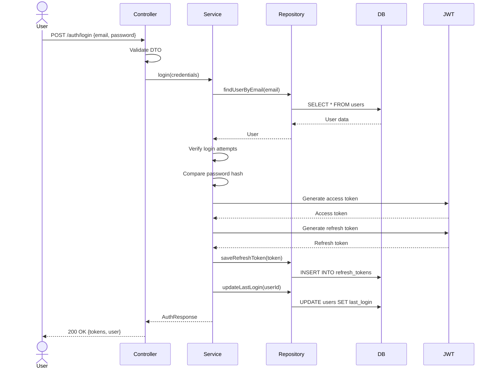
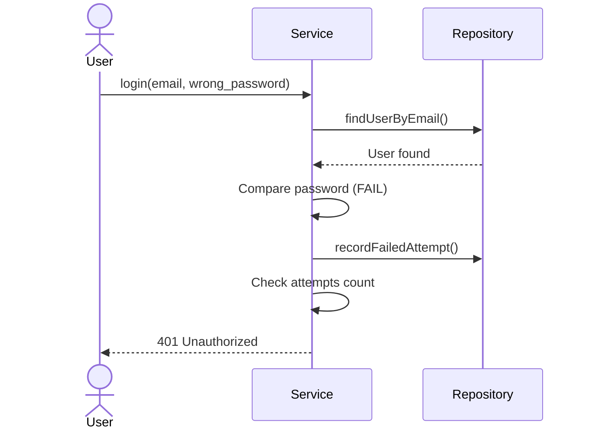
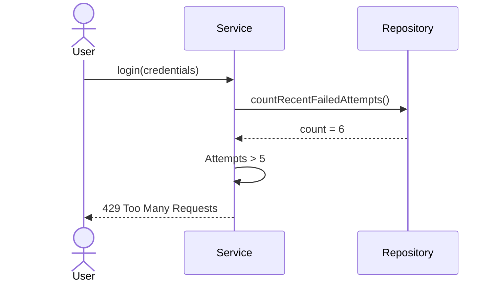

# Componente: [NOME DO COMPONENTE]

**ID**: CMP-[NÚMERO]
**Container Pai**: [CNT-XXX - Nome do Container](../../containers/CNT-XXX_nome.md)
**Camada**: [Presentation | Application | Domain | Infrastructure]
**Status**: [🟢 Estável | 🟡 Em Desenvolvimento | 🔴 Deprecated | 🟣 Refactoring]

---

## 📋 Identificação

**Nome Completo**: [PREENCHER]

**Namespace/Package**: [PREENCHER: ex: src/modules/auth]

**Arquivos Principais**:

```
[PREENCHER: Lista de arquivos]
src/modules/auth/
├── auth.service.ts          (Core logic)
├── auth.controller.ts       (HTTP endpoints)
├── auth.repository.ts       (Data access)
├── auth.dto.ts              (Data transfer objects)
├── auth.entity.ts           (Domain model)
├── auth.errors.ts           (Custom errors)
└── __tests__/
    ├── auth.service.spec.ts
    └── auth.integration.spec.ts
```

**Linhas de Código**: [PREENCHER: ~1,500 LOC]

---

## 🎯 Responsabilidade

### Responsabilidade Única (SRP)

[PREENCHER: Qual a ÚNICA responsabilidade deste componente em 1 frase clara]

**Exemplo**: Este componente é responsável por gerenciar o ciclo de vida de autenticação de usuários (login, logout, refresh token).

### O que Faz

**Funcionalidades Principais**:

1. [PREENCHER: Funcionalidade 1 - ex: Validar credenciais de usuário]
2. [PREENCHER: Funcionalidade 2 - ex: Gerar tokens JWT]
3. [PREENCHER: Funcionalidade 3 - ex: Renovar tokens expirados]

**Funcionalidades Secundárias**:

- [PREENCHER: Feature adicional 1]
- [PREENCHER: Feature adicional 2]

### O que NÃO Faz
>
> ⚠️ **Importante**: Escopo explicitamente fora deste componente

- ❌ [PREENCHER: ex: Não gerencia permissões (isso é feito pelo AuthorizationService)]
- ❌ [PREENCHER: ex: Não envia emails (delegado ao NotificationService)]
- ❌ [PREENCHER: ex: Não armazena senhas (delegado ao PasswordService)]

---

## 🏗️ Estrutura

### Arquitetura Interna

```
[PREENCHER: Diagrama de componentes internos ou camadas]

┌──────────────────────────────┐
│   AuthController             │  ← HTTP Layer
│   - POST /login              │
│   - POST /logout             │
│   - POST /refresh            │
└──────────┬───────────────────┘
           │
           ▼
┌──────────────────────────────┐
│   AuthService                │  ← Business Logic
│   - validateCredentials()    │
│   - generateTokens()         │
│   - refreshToken()           │
└──────────┬───────────────────┘
           │
           ▼
┌──────────────────────────────┐
│   AuthRepository             │  ← Data Access
│   - findUserByEmail()        │
│   - saveRefreshToken()       │
└──────────────────────────────┘
```

### Classes/Arquivos Principais

#### 1. [AuthService]

```typescript
[PREENCHER: Interface/Signature da classe principal]

export class AuthService {
  constructor(
    private userRepository: UserRepository,
    private jwtService: JwtService,
    private hashService: HashService
  ) {}

  async login(credentials: LoginDto): Promise<AuthResponse>
  async logout(token: string): Promise<void>
  async refreshToken(refreshToken: string): Promise<AuthResponse>
  async validateToken(token: string): Promise<User>
}
```

**Responsabilidade**: [PREENCHER: Gerenciar lógica de negócio de autenticação]

**Complexidade**: [PREENCHER: Ciclomática: 8, Cognitiva: 12]

---

#### 2. [AuthController]

```typescript
[PREENCHER: Signature dos endpoints]

@Controller('/auth')
export class AuthController {
  constructor(private authService: AuthService) {}

  @Post('/login')
  async login(@Body() credentials: LoginDto): Promise

  @Post('/logout')
  @UseGuards(AuthGuard)
  async logout(@CurrentUser() user: User): Promise

  @Post('/refresh')
  async refresh(@Body() dto: RefreshDto): Promise
}
```

**Responsabilidade**: [PREENCHER: Expor endpoints HTTP e validar inputs]

---

#### 3. [AuthRepository]

```typescript
[PREENCHER: Interface de persistência]

export class AuthRepository {
  constructor(private db: Database) {}

  async findUserByEmail(email: string): Promise
  async saveRefreshToken(userId: string, token: string): Promise
  async revokeRefreshToken(token: string): Promise
  async findRefreshToken(token: string): Promise
}
```

**Responsabilidade**: [PREENCHER: Acesso a dados de autenticação]

---

### DTOs (Data Transfer Objects)

```typescript
[PREENCHER: Principais DTOs]

// Input
export class LoginDto {
  @IsEmail()
  email: string;

  @MinLength(8)
  password: string;
}

// Output
export class AuthResponse {
  accessToken: string;
  refreshToken: string;
  expiresIn: number;
  user: UserDto;
}
```

---

## 🔗 Dependências

### Componentes Internos (Mesmo Container)

| Componente | Tipo | Uso | Acoplamento |
|------------|------|-----|-------------|
| [CMP-XXX UserRepository] | Injeção de Dependência | Buscar dados de usuário | Forte |
| [CMP-YYY PasswordService] | Injeção de Dependência | Validar senha | Médio |
| [CMP-ZZZ NotificationService] | Event-driven | Notificar login | Fraco |

**Componentes que Dependem Deste**:

- [CMP-AAA ProfileController] - Para obter usuário autenticado
- [CMP-BBB AdminGuard] - Para validar token

### Bibliotecas Externas

| Biblioteca | Versão | Propósito | Criticidade |
|------------|--------|-----------|-------------|
| `jsonwebtoken` | ^9.0.0 | Geração e validação de JWT | 🔴 Alta |
| `bcrypt` | ^5.1.0 | Hashing de senhas | 🔴 Alta |
| `class-validator` | ^0.14.0 | Validação de DTOs | 🟡 Média |

---

## 📤 Interface Pública

### Métodos/Funções Expostos

#### `login(credentials: LoginDto): Promise<AuthResponse>`

**Descrição**: Autentica usuário com email e senha

**Parâmetros**:

- `credentials.email`: Email do usuário (validado como email)
- `credentials.password`: Senha do usuário (mínimo 8 caracteres)

**Retorno**:

```typescript
{
  accessToken: string,    // JWT válido por 1h
  refreshToken: string,   // Token válido por 7d
  expiresIn: number,      // Segundos até expiração
  user: UserDto           // Dados públicos do usuário
}
```

**Throws**:

- `InvalidCredentialsError`: Email ou senha incorretos
- `UserInactiveError`: Usuário desativado
- `TooManyAttemptsError`: Muitas tentativas de login

**Exemplo de Uso**:

```typescript
const result = await authService.login({
  email: 'user@example.com',
  password: 'SecureP@ss123'
});

console.log(result.accessToken); // eyJhbGc...
```

**Validações**:

- Email deve ser válido
- Senha deve ter no mínimo 8 caracteres
- Usuário deve existir
- Senha deve corresponder ao hash armazenado
- Usuário deve estar ativo

**Side Effects**:

- Incrementa contador de logins do usuário
- Cria sessão no banco
- Emite evento `UserLoggedIn`
- Log de auditoria

**Performance**: p95 < 200ms

---

#### `logout(token: string): Promise<void>`

[PREENCHER: Repetir estrutura acima]

---

#### `refreshToken(refreshToken: string): Promise<AuthResponse>`

[PREENCHER: Repetir estrutura acima]

---

## ⚙️ Lógica de Negócio

### Regras Implementadas

**Vinculadas a Documentos**:

- [BUS-001: Password Policy](../../../../.rules/BUS-001_password-policy.md) → Senha deve ter mínimo 8 caracteres, 1 maiúscula, 1 número
- [BUS-002: Login Attempts](../../../../.rules/BUS-002_login-attempts.md) → Máximo 5 tentativas em 15 minutos
- [BUS-003: Token Expiration](../../../../.rules/BUS-003_token-expiration.md) → Access token: 1h, Refresh: 7d

**Regras Inline** (quando não justifica arquivo separado):

- Email deve ser único no sistema
- Refresh token só pode ser usado uma vez (rotating tokens)
- Tokens revogados não podem ser reutilizados

### Validações

**Input Validation** (DTOs):

- `email`: Formato de email válido
- `password`: Mínimo 8 caracteres
- `refreshToken`: JWT válido

**Business Validation** (Service):

- Usuário existe
- Usuário está ativo
- Senha corresponde
- Não excedeu tentativas de login
- Token não foi revogado

**Database Constraints**:

- `users.email`: UNIQUE
- `refresh_tokens.token`: UNIQUE

### Invariantes

[PREENCHER: Condições que sempre devem ser verdadeiras]

- **Invariante 1**: Um usuário autenticado sempre tem um access token válido
- **Invariante 2**: Um refresh token só pode estar associado a um único usuário
- **Invariante 3**: Senhas nunca são armazenadas em plain text

---

## 💾 Persistência

### Dados Manipulados

**Entidades**:

- `User` (read/update)
- `RefreshToken` (create/read/delete)
- `LoginAttempt` (create/read)

**Operações CRUD**:

| Entidade | Create | Read | Update | Delete |
|----------|--------|------|--------|--------|
| User | ❌ | ✅ | ✅ (last_login) | ❌ |
| RefreshToken | ✅ | ✅ | ❌ | ✅ |
| LoginAttempt | ✅ | ✅ | ❌ | ❌ |

### Repositórios Usados

| Repositório | Interface | Implementação | Responsabilidade |
|-------------|-----------|---------------|------------------|
| UserRepository | `IUserRepository` | `PostgresUserRepository` | Acesso a dados de usuários |
| TokenRepository | `ITokenRepository` | `PostgresTokenRepository` | Gerenciamento de tokens |

### Queries Principais

```sql
[PREENCHER: Queries mais importantes]

-- Login: Buscar usuário por email
SELECT id, email, password_hash, status, last_login
FROM users
WHERE email = $1 AND deleted_at IS NULL;

-- Validar tentativas de login
SELECT COUNT(*) 
FROM login_attempts
WHERE user_id = $1 
  AND created_at > NOW() - INTERVAL '15 minutes'
  AND success = false;

-- Buscar refresh token
SELECT user_id, token, expires_at, revoked_at
FROM refresh_tokens
WHERE token = $1 AND expires_at > NOW() AND revoked_at IS NULL;
```

### Transações

**Escopo**: [PREENCHER: Quando usa transações]

**Exemplo**:

```typescript
// Login bem-sucedido usa transação para garantir consistência
await this.db.transaction(async (trx) => {
  // 1. Atualizar last_login
  await trx.users.update({ last_login: new Date() });
  
  // 2. Criar refresh token
  await trx.refreshTokens.create({ user_id, token, expires_at });
  
  // 3. Registrar tentativa bem-sucedida
  await trx.loginAttempts.create({ user_id, success: true });
});
```

---

## 🔄 Fluxos

### Fluxo Principal: Login



**Passos Detalhados**:

1. **Validação de Input** (Controller Layer)
   - Valida formato de email
   - Valida comprimento de senha
   - Retorna 400 se inválido

2. **Busca de Usuário** (Service + Repository)
   - Busca usuário por email
   - Retorna 401 se não encontrado

3. **Verificação de Tentativas** (Service)
   - Conta tentativas falhas nos últimos 15min
   - Retorna 429 se > 5 tentativas
   - [Ref: BUS-002](../../../../.rules/BUS-002_login-attempts.md)

4. **Validação de Senha** (Service)
   - Compara senha com hash usando bcrypt
   - Retorna 401 se não corresponder
   - Incrementa contador de tentativas falhas

5. **Verificação de Status** (Service)
   - Verifica se usuário está ativo
   - Retorna 403 se inativo

6. **Geração de Tokens** (Service + JWT)
   - Gera access token (1h)
   - Gera refresh token (7d)
   - [Ref: BUS-003](../../../../.rules/BUS-003_token-expiration.md)

7. **Persistência** (Repository)
   - Salva refresh token no banco
   - Atualiza last_login do usuário
   - Registra tentativa bem-sucedida

8. **Auditoria** (Service)
   - Emite evento `UserLoggedIn`
   - Log de auditoria com IP e user-agent

9. **Resposta** (Controller)
   - Retorna 200 com tokens e dados do usuário

**Pós-condições**:

- Usuário possui tokens válidos
- Sessão criada no banco
- Evento de auditoria emitido

---

### Fluxo Alternativo: Senha Incorreta



**Consequências**:

- Incrementa contador de tentativas falhas
- Retorna erro genérico (não revela se usuário existe)
- Após 5 tentativas: bloqueia por 15 minutos

---

### Fluxo de Erro: Muitas Tentativas



**Mitigação**:

- Implementar CAPTCHA após 3 tentativas falhas
- Notificar usuário por email sobre tentativas suspeitas
- Considerar exponential backoff

---

## 🧪 Testes

### Cobertura

- **Unitários**: [PREENCHER: 95%]
- **Integração**: [PREENCHER: 85%]
- **Cobertura Total**: [PREENCHER: 92%]

**Meta**: > 90%

**Arquivo de Cobertura**: `coverage/auth-module/index.html`

### Testes Unitários

**Quantidade**: [PREENCHER: 45 testes]

**Cenários Cobertos**:

**AuthService.login()**:

- ✅ Should login with valid credentials
- ✅ Should throw InvalidCredentialsError with wrong password
- ✅ Should throw UserNotFoundError when user doesn't exist
- ✅ Should throw UserInactiveError when user is inactive
- ✅ Should throw TooManyAttemptsError after 5 failed attempts
- ✅ Should generate valid access token
- ✅ Should generate valid refresh token
- ✅ Should save refresh token to database
- ✅ Should update user's last_login
- ✅ Should emit UserLoggedIn event

**AuthService.logout()**:

- ✅ Should revoke refresh token
- ✅ Should emit UserLoggedOut event
- ✅ Should handle already revoked token

**AuthService.refreshToken()**:

- ✅ Should generate new tokens with valid refresh token
- ✅ Should throw InvalidTokenError with expired token
- ✅ Should throw InvalidTokenError with revoked token
- ✅ Should implement rotating refresh tokens

**Exemplo de Teste**:

```typescript
describe('AuthService', () => {
  describe('login', () => {
    it('should return tokens when credentials are valid', async () => {
      // Arrange
      const credentials = { 
        email: 'user@example.com', 
        password: 'ValidP@ss123' 
      };
      
      const mockUser = {
        id: '123',
        email: credentials.email,
        password_hash: await bcrypt.hash(credentials.password, 10),
        status: 'active'
      };
      
      userRepository.findByEmail.mockResolvedValue(mockUser);
      tokenRepository.countFailedAttempts.mockResolvedValue(0);
      
      // Act
      const result = await authService.login(credentials);
      
      // Assert
      expect(result).toHaveProperty('accessToken');
      expect(result).toHaveProperty('refreshToken');
      expect(result.user.email).toBe(credentials.email);
      
      expect(tokenRepository.saveRefreshToken).toHaveBeenCalledWith(
        expect.objectContaining({
          userId: mockUser.id,
          token: expect.any(String)
        })
      );
    });
    
    it('should throw TooManyAttemptsError after 5 failed attempts', async () => {
      // Arrange
      userRepository.findByEmail.mockResolvedValue(mockUser);
      tokenRepository.countFailedAttempts.mockResolvedValue(6);
      
      // Act & Assert
      await expect(authService.login(credentials))
        .rejects
        .toThrow(TooManyAttemptsError);
    });
  });
});
```

### Testes de Integração

**Quantidade**: [PREENCHER: 15 testes]

**Cenários**:

- ✅ Full login flow with real database
- ✅ Token refresh flow end-to-end
- ✅ Logout invalidates token
- ✅ Concurrent login attempts handling
- ✅ Password hashing integration

**Exemplo**:

```typescript
describe('AuthController (Integration)', () => {
  it('POST /auth/login should return tokens', async () => {
    // Setup: Create user in test DB
    await testDb.users.create({
      email: 'test@example.com',
      password_hash: await bcrypt.hash('Pass123!', 10)
    });
    
    // Act
    const response = await request(app)
      .post('/auth/login')
      .send({
        email: 'test@example.com',
        password: 'Pass123!'
      })
      .expect(200);
    
    // Assert
    expect(response.body).toHaveProperty('accessToken');
    expect(response.body).toHaveProperty('refreshToken');
    
    // Verify token in database
    const tokenInDb = await testDb.refreshTokens.findOne({
      token: response.body.refreshToken
    });
    expect(tokenInDb).toBeDefined();
  });
});
```

### Testes de Segurança

**Cenários**:

- ✅ Cannot login with SQL injection in email
- ✅ Rate limiting prevents brute force
- ✅ Tokens are properly signed and verified
- ✅ Password timing attack resistance
- ✅ No sensitive data in logs/errors

---

## 🎨 Padrões de Design

### Padrões Aplicados

#### 1. Repository Pattern

**Onde**: `AuthRepository`, `UserRepository`

**Por quê**:

- Abstrai acesso a dados
- Facilita testes (mock repositories)
- Permite trocar implementação de persistência

**Exemplo**:

```typescript
// Interface
interface IUserRepository {
  findByEmail(email: string): Promise;
}

// Implementação
class PostgresUserRepository implements IUserRepository {
  async findByEmail(email: string) {
    return this.db.query('SELECT * FROM users WHERE email = $1', [email]);
  }
}
```

---

#### 2. Dependency Injection

**Onde**: Todos os services

**Por quê**:

- Inversão de controle
- Facilita testes
- Permite substituir dependências

**Exemplo**:

```typescript
class AuthService {
  constructor(
    private userRepo: IUserRepository,    // Injected
    private jwtService: IJwtService,      // Injected
    private hashService: IHashService     // Injected
  ) {}
}
```

---

#### 3. DTO (Data Transfer Object)

**Onde**: Toda comunicação entre camadas

**Por quê**:

- Validação de dados
- Controle de dados expostos
- Desacoplamento de entidades internas

---

#### 4. Error Handling Strategy

**Onde**: Custom errors com hierarquia

**Por quê**:

- Erros específicos do domínio
- Facilita tratamento na camada de apresentação

**Hierarquia**:

```typescript
AppError
  └── AuthError
      ├── InvalidCredentialsError
      ├── UserInactiveError
      ├── TooManyAttemptsError
      └── InvalidTokenError
```

---

## 📊 Complexidade

### Métricas

**Complexidade Ciclomática**: [PREENCHER: Média 6, Máx 12]

**Complexidade Cognitiva**: [PREENCHER: Média 8, Máx 15]

**Linhas de Código**:

- **Total**: ~1,500 LOC
- **Service**: ~500 LOC
- **Controller**: ~200 LOC
- **Repository**: ~300 LOC
- **Tests**: ~500 LOC

**Número de Métodos**: [PREENCHER: 18 métodos públicos]

**Dependências Externas**: [PREENCHER: 3 (bcrypt, jsonwebtoken, class-validator)]

### Hotspots de Complexidade

| Método | Ciclomática | Cognitiva | Motivo | Plano |
|--------|-------------|-----------|--------|-------|
| `login()` | 12 | 15 | Múltiplas validações e caminhos | Refatorar em submétodos |
| `validateToken()` | 8 | 10 | Várias verificações de token | OK, complexidade inerente |

**Ação Planejada**:

- Extrair `validateLoginAttempts()` de `login()`
- Extrair `generateTokenPair()` de `login()`
- Target: Reduzir complexidade de `login()` para < 8

---

## 🔒 Segurança

### Validações de Input

**Camada Controller (DTOs)**:

```typescript
class LoginDto {
  @IsEmail()
  @MaxLength(255)
  email: string;

  @IsString()
  @MinLength(8)
  @MaxLength(128)
  password: string;
}
```

**Camada Service (Business)**:

- Verifica se usuário existe
- Valida status do usuário
- Verifica tentativas de login
- Compara hash de senha

### Dados Sensíveis

**Tipos**:

- 🔴 **Senha do usuário**: Nunca armazenada em plain text
- 🔴 **Tokens JWT**: Contém informações do usuário
- 🟡 **Email**: PII, deve ser protegido

**Proteção**:

**Senhas**:

```typescript
// Hashing com bcrypt (salt rounds = 10)
const hash = await bcrypt.hash(password, 10);

// Comparação timing-attack resistant
const isValid = await bcrypt.compare(password, hash);
```

**Tokens**:

```typescript
// JWT assinado com HS256
const token = jwt.sign(payload, SECRET, { 
  expiresIn: '1h',
  algorithm: 'HS256'
});

// Secret rotacionado trimestralmente
```

**Logs**:

```typescript
// Nunca logar senhas
logger.info('User login attempt', {
  email: user.email,  // OK
  // password: NEVER!
});

// Mascarar tokens em logs
logger.debug('Token generated', {
  token: token.substring(0, 10) + '...'  // Apenas primeiros 10 chars
});
```

### Vulnerabilidades Prevenidas

- ✅ **SQL Injection**: Prepared statements / ORM
- ✅ **Timing Attacks**: bcrypt.compare() com tempo constante
- ✅ **Brute Force**: Rate limiting após 5 tentativas
- ✅ **Rainbow Tables**: Salt único por senha (bcrypt)
- ✅ **Session Fixation**: Novo token a cada login
- ✅ **Token Replay**: Refresh token único (rotating)

---

## ⚡ Performance

### Benchmarks

**Hardware**: 2 vCPU, 4GB RAM

| Operação | Throughput | p50 | p95 | p99 |
|----------|------------|-----|-----|-----|
| `login()` | 500 req/s | 100ms | 250ms | 500ms |
| `validateToken()` | 2000 req/s | 10ms | 30ms | 60ms |
| `refreshToken()` | 800 req/s | 50ms | 150ms | 300ms |

**Gargalo Principal**: bcrypt hashing (100ms)

### Otimizações Aplicadas

**1. Cache de Tokens Validados**:

```typescript
// Cache JWT validation por 5 minutos
const cachedUser = await cache.get(`token:${token}`);
if (cachedUser) return cachedUser;

const user = await this.validateToken(token);
await cache.set(`token:${token}`, user, 300); // 5min TTL
```

**Impacto**: Redução de 80% na latência de validação

**2. Database Index em email**:

```sql
CREATE INDEX idx_users_email ON users(email);
```

**Impacto**: Query de `O(n)` para `O(log n)`

**3. Connection Pooling**:

```typescript
pool: {
  min: 5,
  max: 20,
  idleTimeoutMillis: 30000
}
```

### Bottlenecks Conhecidos

| Componente | Descrição | Impacto | Solução Planejada | ETA |
|------------|-----------|---------|------------------|-----|
| bcrypt | Hashing lento (100ms) | Latência no login | Considerar Argon2 | Q3 2024 |
| Database | Query de login_attempts sem index | +50ms em verificação | Adicionar index | Q2 2024 |

### Limites

**Capacidade Atual**:

- **Max logins simultâneos**: ~500/s
- **Max validações simultâneas**: ~2000/s

**Próximo Bottleneck**: bcrypt CPU-bound em ~800 logins/s

---

## 🔄 Evolução

### Histórico de Mudanças Principais

| Data | Versão | Mudança | Motivo | Impacto |
|------|--------|---------|--------|---------|
| 2023-01-15 | 1.0.0 | Implementação inicial | Nova feature | N/A |
| 2023-03-20 | 1.1.0 | Adicionado rate limiting | Segurança | Nenhum (backwards compatible) |
| 2023-06-10 | 1.2.0 | Refresh token rotating | Segurança | Breaking (tokens antigos invalidados) |
| 2024-01-05 | 2.0.0 | Migrado para JWT HS256 | Performance | Breaking (requer re-login) |

### Refatorações Planejadas

**Q2 2024**:

- [ ] Extrair `LoginAttemptsService` (reduzir complexidade)
- [ ] Adicionar MFA (Two-Factor Authentication)
- [ ] Implementar "Remember Me" functionality

**Q3 2024**:

- [ ] Migrar de bcrypt para Argon2 (performance)
- [ ] Implementar OAuth 2.0 providers (Google, GitHub)

**Q4 2024**:

- [ ] Biometric authentication support

### Débito Técnico

**TD-015: Falta de Circuit Breaker para serviços externos**

**Localização**: `AuthService.validateWithExternalProvider()`

**Impacto**:

- **Disponibilidade**: 🔴 Alto - se provedor externo cai, nossa API trava
- **Performance**: 🟡 Médio - timeouts longos degradam experiência

**Contexto**: Implementado rapidamente sem considerar falhas de rede

**Plano de Resolução**:

1. Implementar circuit breaker com Opossum
2. Adicionar fallback para validação local
3. Monitorar taxa de falhas

**Esforço**: 3 story points

**Prioridade**: 🔴 Alta

**Target**: Sprint 15 (Q2 2024)

**Referência**: [TD-015](../../../11_risks/011_risks-and-technical-debt.md#td-015)

---

## 📝 Notas de Implementação

### Decisões Técnicas Importantes

**1. Por que bcrypt ao invés de scrypt/Argon2?**

- Bcrypt é battle-tested e amplamente suportado
- Performance adequada para nossa escala atual
- Planejamos migrar para Argon2 em Q3 2024

**2. Por que JWT ao invés de Session-based auth?**

- Stateless: facilita escalabilidade horizontal
- Reduz carga no database
- Facilita comunicação entre microservices
- Trade-off: dificuldade em invalidar tokens (mitigado com TTL curto)

**Referência**: [ADR-005](../../../09_decisions/adrs/ADR-005_jwt-authentication.md)

**3. Por que rotating refresh tokens?**

- Previne token replay attacks
- Detecta roubo de tokens (dois clientes usando mesmo token)
- Aumenta segurança sem impactar UX

**Referência**: [ADR-008](../../../09_decisions/adrs/ADR-008_rotating-refresh-tokens.md)

### Alternativas Consideradas

**Argon2 para password hashing**:

- **Prós**: Mais rápido, mais seguro, vencedor da Password Hashing Competition
- **Contras**: Menos suporte em diferentes plataformas, menos battle-tested
- **Decisão**: Usar bcrypt agora, migrar para Argon2 depois de 6 meses de uso

**Session-based authentication**:

- **Prós**: Fácil de invalidar, amplamente conhecido
- **Contras**: Stateful (requer Redis/DB), não escala bem horizontalmente
- **Decisão**: Rejeitado, prioridade é escalabilidade

### Trade-offs

**JWT Stateless vs Revogabilidade**:

- **Escolhemos**: JWT stateless
- **Ganhamos**: Escalabilidade, performance
- **Perdemos**: Capacidade de invalidar tokens instantaneamente
- **Mitigação**: TTL curto (1h) + blacklist para logout explícito

---

## 🔗 Navegação

**Hierarquia**:

- ⬆️ **Parent Container**: [CNT-003 Backend API](../../containers/CNT-003_backend-api.md)
- ⬆️ **Building Blocks**: [Overview](../../005_building-block-view.md)
- ⬇️ **Children**: N/A (componente leaf)

**Componentes Relacionados (mesmo container)**:

- [CMP-011 UserService](./CMP-011_user-service.md) - Usa para buscar dados de usuário
- [CMP-012 NotificationService](./CMP-012_notification-service.md) - Notifica eventos de autenticação
- [CMP-013 AuditService](./CMP-013_audit-service.md) - Registra ações de autenticação

**Relacionados em Outras Seções**:

- 📋 **Regras de Negócio**:
  - [BUS-001 Password Policy](../../../../.rules/BUS-001_password-policy.md)
  - [BUS-002 Login Attempts](../../../../.rules/BUS-002_login-attempts.md)
  - [BUS-003 Token Expiration](../../../../.rules/BUS-003_token-expiration.md)
- 🎬 **Runtime**: [Login Flow](../../../06_runtime/006_runtime-view.md#cenario-1-login)
- 🔐 **Segurança**: [Authentication](../../../08_crosscutting/008_crosscutting-concepts.md#82-segurança)
- 📝 **ADRs**:
  - [ADR-005 JWT Authentication](../../../09_decisions/adrs/ADR-005_jwt-authentication.md)
  - [ADR-008 Rotating Refresh Tokens](../../../09_decisions/adrs/ADR-008_rotating-refresh-tokens.md)
- 🎯 **Quality**: [Q-003 Security](../../../10_quality/010_quality-requirements.md#q-003)
- ⚠️ **Débito Técnico**: [TD-015](../../../11_risks/011_risks-and-technical-debt.md#td-015)
- 📖 **Glossário**:
  - [JWT](../../../12_glossary/012_glossary.md#jwt)
  - [Refresh Token](../../../12_glossary/012_glossary.md#refresh-token)

**Testes**:

- `tests/unit/auth.service.spec.ts`
- `tests/integration/auth.integration.spec.ts`
- `tests/e2e/auth.e2e.spec.ts`

**Código**:

- `src/modules/auth/auth.service.ts`
- `src/modules/auth/auth.controller.ts`
- `src/modules/auth/auth.repository.ts`

---

**Criado em**: [YYYY-MM-DD]  
**Atualizado em**: [YYYY-MM-DD]  
**Responsável**: [PREENCHER: Nome do desenvolvedor/time]  
**Última Revisão de Código**: [YYYY-MM-DD]  
**Próxima Revisão Planejada**: [YYYY-MM-DD]
